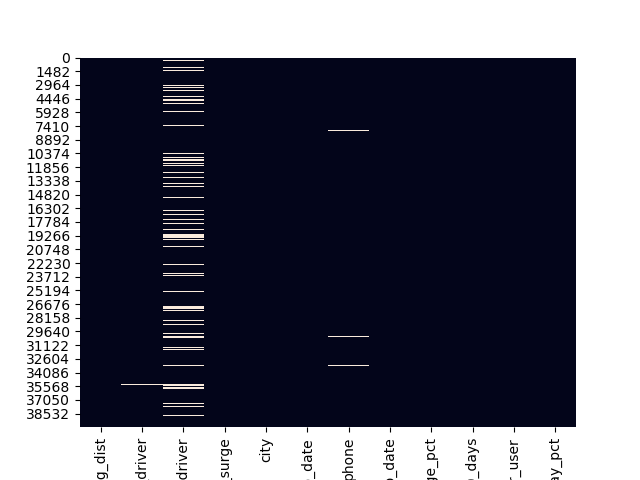

# Case Study: Ride-Sharing Churn Prediction
## Group:
- Emily Levis
- Mathias Stensrud
- Ryan Holway
- Chris Enyeart

## Description
A ride-sharing company (Company X) is interested in predicting rider retention.
To help explore this question, we analyzed a sample dataset of a cohort of
users who signed up for an account in January 2014. The data was pulled on July
1, 2014; based on the recommendation we considered a user retained if they were
“active” (i.e. took a trip) in the preceding 30 days (from the day the data was
pulled) else they churned. In other words, a user is "active" if they have
taken a trip since June 1, 2014.

## Data Cleansing
We started with a dataset where there was some missing and non-numeric data.  
Our analysis of the data started with data looking like the following with white
being :

| field                  | change                               |        
| ---------------------- | ------------------------------------------
| avg_rating_of_driver   | Missing changed to 2.5  
| avg_rating_by_driver   | Missing removed
| phone                  | iPhone changed to 1 Android changed to 0
| signup_date            | Removed based on description above
| luxury_car_user        | changed to 1 and 0
| Churn                  | Calculated based on dates if they did not take a trip in the preceding 30 days Churn
| city                   | Changed to Dummies

After changes above data looked liked the following diagram:

## Code
The data was cleansed after discussing with team, Mathias created a clean csv using pandas and standard Python code.
Models were created by each team member and eventually combined by Ryan to create a common set of results to review.

## Models

The group created models for Logistic Regression, Decision Trees, Random Forest, Naive Bayes, and Gradient Boosting.  

[Tree1](https://files.slack.com/files-pri/T1T555TL0-FDPEUCE4U/tree.png)

[Tree2](https://files.slack.com/files-pri/T1T555TL0-FDPEUCE4U/tree2.png)

### Testing

The group performed standard train test split on the data to find the best model.    

### Results

| Model                  | Accuracy | Precision | Recall |        
| ---------------------- | ---------| ------    | -------
| Logistic Regression    | 0.733    | 0.750     | 0.863
| Decision Tree          | 0.711    | 0.769     | 0.774
| Random Forest          | 0.764    | 0.803     | 0.828
| Naive Bayes            | 0.671    | 0.713     | 0.801
| Gradient Boosting      | 0.796    | 0.815     | 0.875

### Best Model Gradient Boosting 
Since the goal of our models is a classification, we used a ROC curve and the precision and accuracy rates as seen above to evaluate our models. Based on this, the best model is the gradient boosting because it had the highest accuracy/precision and also the highest area under the ROC curve.

Confusion matrix for this model:

| TN    | FN            |       
|------ | ------------- |
| FP    | TP            |

| 2212  | 1417          |       
|------ | ------------- |
| 754   | 5498          |

## Summary

From here, we want to look at the features of importance for our gradient boosting model and find which are immediately influential. Based on this, the feature we want to focus on is surge percentage because it gives us the largest impact out of these features that we can change. If our model predicts that a customer might churn, we would want to lower the surge price.

## Future
In the future we would like to work with the hyperparameters of each model to increase accuracy.  Since our data is limited to 2014 we would also like to get additional data for different years.   We would want to look into why average distance has such a high impact on our churn rate, and if there’s anything we can do to influence that.
